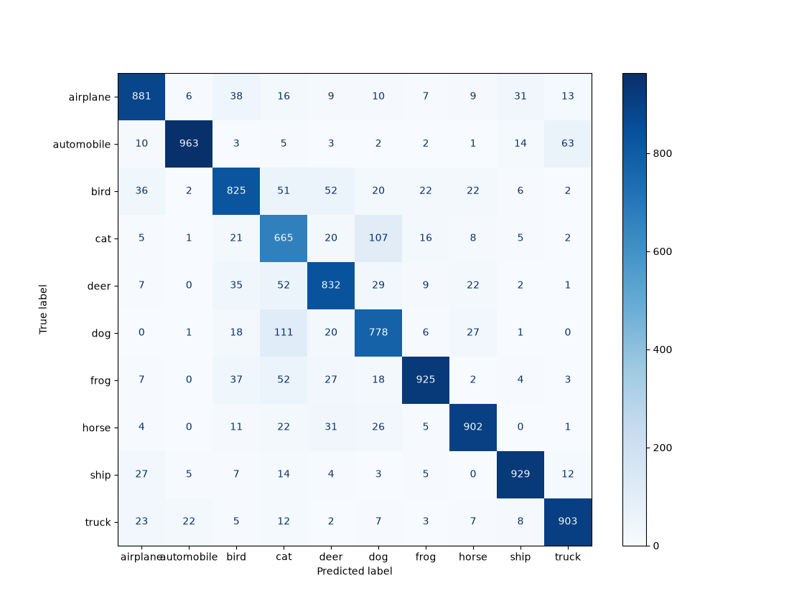
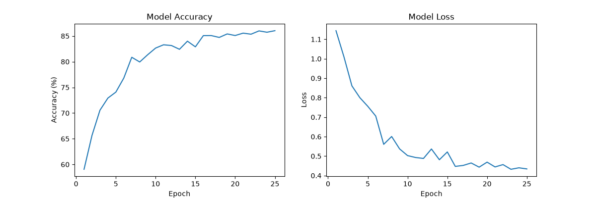

# Learning PyTorch and CNNs using CIFAR-10: 86.03% accuracy

## Overview
I wanted to learn CNN architecture and convolutional layers while also learning PyTorch. Building upon my previous experience making a neural net from scratch in numpy arrays, PyTorch seemed important to learn. I experimented a lot to achieve this test accuracy.  
  
I learned a lot of different things in PyTorch, CNNs, and the whole ML pipeline.

## My Architecture

### What I used(and learned):
 - `torchvision.transforms`
 - `torch.nn.Module`
 - Tensors
 - Conv2d, BatchNorm2d, MaxPool2d
 - DataLoader
 - Adam optimizer (and originally Stochastic Gradient Descent)
 - CUDA for training
 - CrossEntropyLoss
 - Data Augmentation
 - Learning Rate scheduler


This project gave me a better understanding of how CNN architecture works and affects model capacity and computational cost. I had to figure out how to use my laptop's GPU, a bunch of methods of improving upon my basic CNN, and many small details to evaluate my model beyond test accuracy.

 ### My actual arch:  

 **Input:** `(3, 32, 32)` → **Output:** 10 classes
 25 epochs in the end, although I only used 10 epochs during my experimentation

| Stage | Layer | Output Shape |
|---|---|---|
| Block 1 | `Conv2d(3→32, k=3, p=1)` + BatchNorm + ReLU | (32, 32, 32) |
| Block 1 | `Conv2d(32→64, k=3, p=1)` + BatchNorm + ReLU | (64, 32, 32) |
| Block 1 | `MaxPool2d(k=2, s=2)` | (64, 16, 16) |
| Block 2 | `Conv2d(64→128, k=3, p=1)` + BatchNorm + ReLU | (128, 16, 16) |
| Block 2 | `Conv2d(128→256, k=3, p=1)` + BatchNorm + ReLU | (256, 16, 16) |
| Block 2 | `MaxPool2d(k=2, s=2)` | (256, 8, 8) |
| Classifier | `Flatten` | 16,384 |
| Classifier | `Linear(16384→512)` + ReLU | 512 |
| Classifier | `Linear(512→64)` + ReLU | 64 |
| Classifier | `Linear(64→10)` | 10 |

There were a lot of parameters here: **16,384 * 512 in the first linear layer alone is 8.4M**

## Experimentation

My [experiments.md](./experiments.md) contains full experiment logs.

- **Wider channels helped a lot.** Going from `32→64→128` to `64→128→256` gave the biggest single accuracy jump (~0.72 -> ~0.78+). I noticed they also raised computational cost significantly.
- **BatchNorm** smoothened training a lot, improved curves from jagged/spiky to stable, and gave a solid accuracy bump on its own().
- **Adam converged much faster**, hitting ~72% by epoch 3 vs SGD needing far longer. I didn't extensively fine-tune SGD, though.
- **Data augmentation helped.** Random flip + resized crop + rotation stacked additively and gave decently consistent gains.
- **Lots of run-to-run variance.**
- **Often, more epochs lead to greater overfitting.**
- **I tested different linear layers early**, but I would go back to continue testing now to reduce computational cost.

## Results

Final accuracy: **86.03%**

### Confusion Matrix:  
  

### Training graphs for test accuracy & loss


## Project Structure

```text
cnn-cifar-10/
├── README.md
├── requirements.txt
├── LICENSE
├── experiments.md
├── data/              # Downloaded locally
├── saved_images/      # Graph and confusion matrix
└── src/
    ├── dataset.py     # Dataset and DataLoader setup
    ├── model.py       # CNN architecture
    ├── train.py       # Model training and evaluation
    └── eval.py    # Independent model evaluation